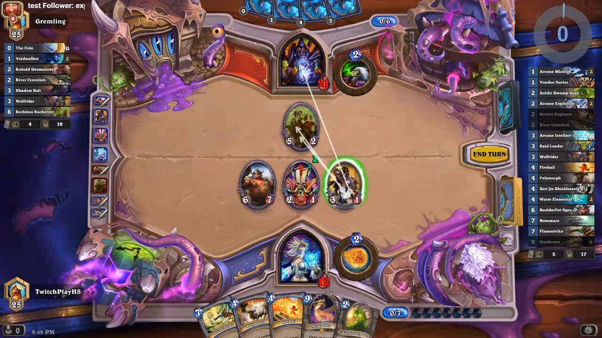

[TwitchPlayzHS](https://www.twitch.tv/twitchplayzhs) (former [MixerPlaysHS](https://mixer.com/mixerplayshs)) was an interactive livestream experiment, which allowed viewers on [twitch.tv](https://www.twitch.tv) to play Hearthstone together on stream. Mouse input was collected from viewers using the brand new Twitch Extension system. The extension ["Screen Controls"](https://github.com/Vilvalas/screen-controls) was developed by myself and used as stream overlay. Mouse input was send to my AWS-Server, which evaluated inputs (sorting out invalid inputs and calculating the user action with the most agreement each time step). The resulting action for each time step was send to my streaming PC, which automatically executed the action. Initially I was using Mixer Interactive and provided one click buttons for emotes, but moved over to twitch.tv due to insufficient amount of viewers. Unfortunately I didn't save the peak gameplay with over 50 concurrent players. Currently there only exists one gameplay video [here](https://www.twitch.tv/videos/177470538).

This repository was a proof of concept, which worked out rather well. Recently Twitch vastly decreased stream latency. I am considering to rebuild the project from scratch and relaunch it some day in the future.

